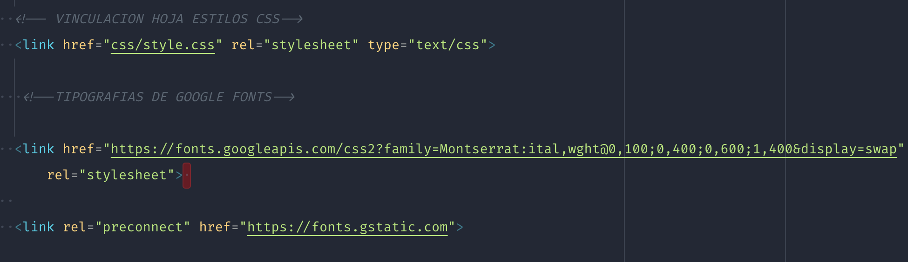

# Review Final

Veo que has conseguido muchas cosas y que te has esforzado mucho en el proyecto, y aunque no haya terminado el responsive, creo que el ejercicio de re-hacer el site ha valido la pena. Te paso algo de feedback para que lo sigas mejorando.

En la cabecera deberías añadir el idioma de tu página


Y en los casos que utilices otro idioma en elementos concretos, también les puedes asignar el idioma correspondiente


Aprovecho esta imagen para comentar que te faltó añadir el atributo `href` del link, por lo tanto, este elemento no tiene link y no puedo acceder a la página concreta del proyecto, y añadir el atributo `alt` de la imagen. Debería haber sido:

```html
<a href="/work/elsincansables.html" class="project">
    <h2 lang="ca">Els Incansables</h2><p>Social Design</p>
    
</a>
```

Dentro de la cabecera también te falla el orden de los elementos. El `preconnect` debería estar arriba del todo, cerca del meta charset, y el archivo `style.css` después de las google fonts.



Quedaría algo como:

```html
<!DOCTYPE html>
<html lang="en">
    <head>
        <meta charset="UTF-8">
        <link rel="preconnect" href="https://fonts.gstatic.com">
        <title>Paula Batlle</title>
        <!--TIPOGRAFIAS DE GOOGLE FONTS-->
        <link href="https://fonts.googleapis.com/css2?family=Montserrat:ital,wght@0,100;0,400;0,600;1,400&display=swap" rel="stylesheet">
        <!-- VINCULACION HOJA ESTILOS CSS-->
        <link href="css/style.css" rel="stylesheet" type="text/css">
    </head>
    <body>
        ...
    </body>
</html>
```

En el footer, intenta no utilizar headings (como el `<h6>`) para estilar elementos, no es nada recomendable. Especialmente si puede ser enlaces que ayuden al usuario, como en este caso, para contactarte


Recuerda también de añadir el `target="_blank"` y los `rel="noreferrer noopener"` a los enlaces que vayan fuera de tu página. Es recomendable.

En cuanto a las imágenes, ten en cuenta el tamaño, veo que varias están optimizadas, pero la de tu perfil pesa bastante y hará más lenta tu página. En principio no deberían pesar más de 300/400 KB (las imágenes grandes) o por lo menos, menos de 1MB (si son muy grandes). Actualmente tienes alguna imagen de varios megas, tienes [algunas opciones online](https://tinypng.com/) para optimizarlas.


En cuanto al CSS, te recomiendo que aproveches a añadir las variables CSS que vimos en las últimas clases y que aproveches a agrupar estilos para hacer más pequeño el archivo, antes de añadir el responsive. Y no te olvides de añadir el `reset` que utilizamos en los ejercicios. Esto ayudará a mejora la compatibilidad entre navegadores. Por ejemplo, puedes mejorar los estilos de la siguiente manera, y recuerda añadir la tipografía woff2 que es mejor. Igualmente, no hace falta ponerle nombres diferentes a las tipos, solo definir el `font-weight` y la ruta al archivo que debe utilizar para ese peso.

```css
@font-face{
    font-family: "Trash";
    font-display: swap;
    font-style: normal;
    font-weight: 300;
    src: local("Trash"), url(../assets/trash/trashregular-webfont.woff2) format("woff2"), url(../assets/trash/trashregular-webfont.woff) format("woff");
}

@font-face{
    font-family: "Trash";
    font-display: swap;
    font-style: normal;
    font-weight: 500;
    src: local("Trash"), url(../assets/trash/trash-medium-webfont.woff2) format("woff2"), url(../assets/trash/trash-medium-webfont.woff) format("woff");
}

@font-face{
    font-family: "Trash";
    font-display: swap;
    font-style: normal;
    font-weight: 700;
    src: local("Trash"), url(../assets/trash/trash-bold-webfont.woff2) format("woff2"), url(../assets/trash/trash-bold-webfont.woff) format("woff");
}

h1, h2, h3, p, .type-trash {
    font-family: 'Trash';
}

h1, h3, .textofondoblanco {
    color: #423434;
}

p {
    font-size: 1.4rem;
    color:#EFF3F3;
    line-height: 1.2em;
    margin-top: 1em;
    letter-spacing: 0.035em;
}

h1{
    font-weight: 500;
    font-size: 120px;
    line-height: 1;
    letter-spacing: 0.075em;
}

.textofondoblanco{
    margin-left:5em;
    font-size: 1.4rem;
    line-height: 1.2em;
    margin-top: 1em;
    letter-spacing: 0.035em;
}


h2 {
    color:#EFF3F3;
    font-weight: 500;
    font-size: 60px;
    line-height: 60px;
    letter-spacing: 0.035em;
    margin-top:0.75em;
}


h3{
    font-weight: 700;
    font-size: 36px;
    line-height: 36px;
    letter-spacing: -0.005em;
}

h4{
    font-weight: 300;
    font-size: 16px;
    line-height: 18px;
    letter-spacing: 0.01em;
}
```
